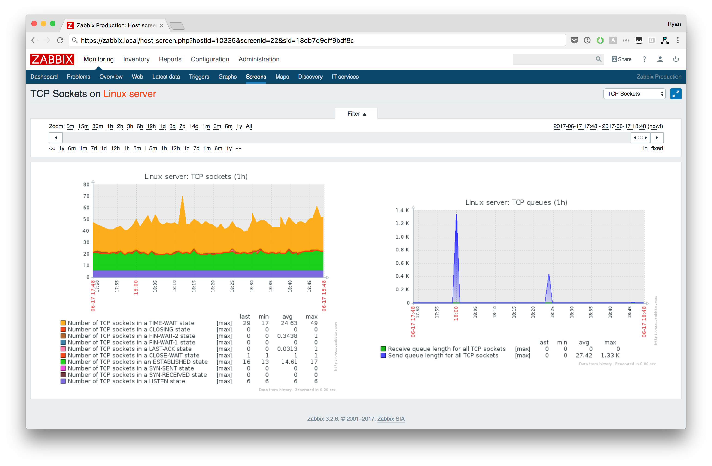

# zabbix-module-sockets

zabbix-module-sockets is a loadable Zabbix module that enables Zabbix to query
the state of sockets - including tcp, udp, unix, raw, etc.



## Install

The following packages are available for download:

- [zabbix-module-sockets-1.1.0.tar.gz](http://cdn.cavaliercoder.com/zabbix-contrib/release/zabbix-module-sockets-1.1.0.tar.gz)

- [zabbix-module-sockets-1.1.0-1.x86_64.rpm](http://cdn.cavaliercoder.com/zabbix-contrib/rhel/7/x86_64/zabbix-module-sockets-1.1.0-1.x86_64.rpm)

To install from source:

```bash
$ ./configure --with-zabbix=/usr/src/zabbix-3.2.5
$ make
$ sudo make install
```

If you are using a packaged version of Zabbix, you may with to redirect the
installation directories as follows:

```
$ sudo make prefix=/usr sysconfdir=/etc libdir=/usr/lib64 install
```

## Keys

```
sockets.count[protocol,<state>] returns the number of sockets for the given
                                protocol

sockets.sendq[protocol,<state>] returns the sum of all buffers in the send queue
                                for sockets of the given protocol

sockets.recvq[protocol,<state>] returns the sum of all buffers in the receive
                                queue for sockets of the given protocol

sockets.modver[]                version of the loaded module
```

### Supported protocols

The following protocols are supported:

- `tcp`
- `tcp6`
- `udp`
- `udp6`
- `unix`

### TCP 4/6 states

You may use the `<state>` parameter to filter for sockets in the following valid
TCP session states:

- `ESTABLISHED`
- `SYN_SENT`
- `SYN_RECV`
- `FIN_WAIT1`
- `FIN_WAIT2`
- `TIME_WAIT`
- `CLOSE`
- `CLOSE_WAIT`
- `LAST_ACK`
- `LISTEN`
- `CLOSING`

If the state parameter is empty, the total number of sockets in any state is
returned.

E.g.

    $ zabbix_agentd -t sockets.count[tcp,listen]
    sockets.count[tcp,listen]                     [u|2]

    $ netstat -tl4
    Active Internet connections (only servers)
    Proto Recv-Q Send-Q Local Address           Foreign Address         State
    tcp        0      0 0.0.0.0:ssh             0.0.0.0:*               LISTEN
    tcp        0      0 0.0.0.0:zabbix-agent    0.0.0.0:*               LISTEN

For greater understanding, see the [TCP/IP State Transition Diagram](http://www.cs.northwestern.edu/~agupta/cs340/project2/TCPIP_State_Transition_Diagram.pdf)
by Gordon McKinney, 2002.

### Unix socket states

You may use the `<state>` parameter to filter for Unix sockets in the following
valid states:

- `FREE`
- `UNCONNECTED`
- `CONNECTING`
- `CONNECTED`
- `DISCONNECTING`
- `LISTEN`

E.g.

    $ zabbix_agentd -t sockets.count[unix,listen]
    sockets.count[unix,listen]                    [u|33]

    $ netstat -xl
    Active UNIX domain sockets (only servers)
    Proto RefCnt Flags       Type       State         I-Node   Path
    unix  2      [ ACC ]     STREAM     LISTENING     17910    private/tlsmgr
    unix  2      [ ACC ]     STREAM     LISTENING     17914    private/rewrite
    unix  2      [ ACC ]     STREAM     LISTENING     17917    private/bounce
    ...
